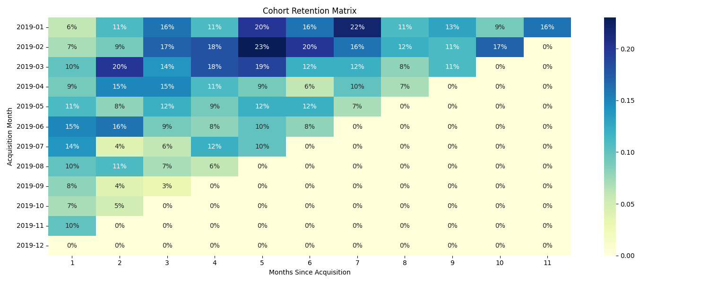

# E-commerce Marketing and Sales Analysis

## Business Context

The objective of this project is to leverage data-driven insights to enhance customer acquisition, retention, and revenue optimization for an e-commerce business.
We analyze transactions, marketing spend, discount strategies, customer behavior, and product performance over the year 2019.

## Dataset Description

This project uses five datasets provided by the business:

| File                  | Description                                                                        |
| --------------------- | ---------------------------------------------------------------------------------- |
| `Online_Sales.csv`    | Transaction-level data (date, SKU, quantity, price, delivery charge, coupon usage) |
| `Customers_Data.csv`  | Demographic data (gender, location, tenure)                                        |
| `Discount_Coupon.csv` | Monthly coupons and discount % by product category                                 |
| `Marketing_Spend.csv` | Daily online & offline marketing spend                                             |
| `Tax_Amount.csv`      | GST rates by product category                                                      |

All source tables have been cleaned and saved to **`eda_outputs/*.csv`**:

| File                          | Rows  | Key Columns                                                  |
|-------------------------------|-------|--------------------------------------------------------------|
| `sales_cleaned.csv`           | 52,924| `customer_id`, `transaction_id`, `transaction_date`, `product_sku`, `product_description`,`product_category`, `quantity`, `avg_price`, `delivery_charges`, `revenue`, `total_amount`, `coupon_status`, `transaction_month`, `weekday` |
| `customers_cleaned.csv`       | 1,468 | `customer_id`, `gender`, `location`, `tenure_months`         |
| `discounts_cleaned.csv`       |   204 | `month`, `product_category`, `coupon_code`, `discount_pct`   |
| `marketing_cleaned.csv`       |   365 | `date`, `offline_spend`, `online_spend`, `marketing_month`   |
| `tax_cleaned.csv`             |    20 | `product_category`, `gst`  

Data Period: **1st Jan 2019 to 31st Dec 2019**

---

## 3. Analysis Outline & Business Questions

1. **Acquisition Peaks & Troughs**  
   Identify the months with the highest and lowest customer acquisition rates.  

2. **Acquisition Seasonality Consistency**  
   Analyze whether certain months consistently over- or under-perform and how to capitalize on strong periods or shore up weak ones.  

3. **Next-Month Retention**  
   Compute cohort-based next-month retention rates by acquisition month.  

4. **Retention Drivers in High-Retention Months**  
   Examine coupon usage, average order value and product mix for cohorts with strongest retention.  

5. **New vs. Existing Revenue Split**  
   Compare month-over-month revenue contributions from new versus existing customers.  

6. **Coupon Usage vs. Revenue**  
   Plot average order value by effective discount % and share of total revenue by discount tier.  

7. **Top Products by Revenue**  
   Identify the top 10 SKUs by total revenue and summarize their coupon rate, avg. price, discount and category.  

8. **Overall Marketing ROI**  
   Calculate monthly ROI as total revenue ÷ total (online + offline) marketing spend.  

9. **Channel ROI Comparison**  
   Break out ROI for offline versus online spend and assess reallocation opportunities.  

10. **RFM Segmentation**  
    Segment customers into Premium, Gold, Silver and Standard using Recency, Frequency & Monetary scoring.  

11. **Segment Revenue Contribution**  
    Measure each segment’s total revenue share and average revenue per customer.  

12. **Cohort Retention Heatmap**  
    Build a cohort × period retention matrix (first 6 months) and compare cohort performance.  

13. **Customer Lifetime Value**  
    Compute average LTV by acquisition month and identify high-LTV cohorts.  

14. **Coupon Impact on AOV**  
    Perform a t-test to compare avg. order value of orders with versus without coupons.  

15. **Demographics & Pricing ANOVA**  
    Test for differences in order value across locations, tenure groups and delivery-charge tiers.  

16. **Tenure vs. Purchase Frequency**  
    Analyze whether customer tenure groups differ in average purchase frequency.  

17. **Delivery-Charge Impact**  
    Compare order count, avg. quantity and avg. order value by delivery-charge tier (ANOVA).  

18. **Taxes & Spending Behavior**  
    Evaluate spending differences across GST tiers and correlate delivery charge with spend.  

19. **Seasonality by Category & Location**  
    Plot monthly revenue trends by product category and by customer location.  

20. **Daily & Weekly Sales Patterns**  
    Visualize daily revenue time series and average revenue by weekday to spot high-/low-performing days.  

---

## Approach
**Step-by-step flow**:

- Data Cleaning: Removed duplicates, validated keys, parsed dates, created new features like revenue and total amount.

- Aggregation: Monthly revenue, customer acquisition, retention, cohort tagging.

- Segmentation: RFM analysis to categorize customers into Premium, Gold, Silver, Standard.

- Merging Datasets: Discounts, tax, marketing spend were joined with transaction data.

- Analysis: Trends, anomalies, behavior patterns, segment-wise contribution, ROI.

---

## 4. Key Visualizations, Insights & Recommendations

**Q1. Identify the months with the highest and lowest acquisition rates. What strategies could be implemented to address the fluctuations and ensure consistent growth throughout the year?**  
**Insight:**  
- **Peak acquisitions** in January (215, +75.7% vs avg), March (177, +44.7%) and April (163, +33.2%).  
- **Lowest** in November (68, –44.4%), September (78, –36.2%) and February (96, –21.5%).  
**Recommendation:** Run targeted Fall promotions (e-mail, paid social) in September–November; boost sign-up incentives in low months; shift budgets into proven high-acq channels in Mar/Apr.

---

**Q2. Analyze the data to determine if certain months consistently show higher or lower acquisition rates. How can the company capitalize on high-performing months and improve performance during slower periods?**  
**Insight:**  
- The same months repeat as strong (Jan, Mar, Apr) and weak (Sep, Nov, Feb).  
**Recommendation:** Pre-plan major product launches or bundle offers in Jan/Mar/Apr; use “early bird” discounts or loyalty bonuses to lift acquisitions in traditionally slow months.

**Result dataset**: 

---

**Q3. Identify periods with the strongest and weakest retention rates. What strategies could be implemented to improve retention during weaker months?**  
**Insight:**  
- **Highest next-month retention**: June (15%), July (14%).  
- **Lowest**: September (8%), December (0%*).  
**Recommendation:** Deploy post-purchase nurture flows (educational tips, cross-sell coupons) for cohorts acquired in weak months (Sep, Oct, Nov).

**Result dataset**: 

---

**Q4. Analyze customer behavior during high-retention months and suggest ways to replicate this success throughout the year.**  
**Insight:**  
- High-retention cohorts (Jun/Jul) have coupon usage ~42–35% but lower avg. order values ($55–$69).  
**Recommendation:** Promote moderate-value coupons (10–20%) in other months to drive repeat visits; pair with “bundles” to preserve overall AOV.

**Result dataset**: 

---

**Q5. Compare the revenue generated by new and existing customers month-over-month. What does this trend suggest about the balance between acquisition and retention efforts?**  
**Insight:**  
- Jan–Mar revenue is 84–100% from **new** customers; by July onward **existing** contribute ~50–60%.  
**Recommendation:** Early in year focus on acquisition; mid-year shift budget toward loyalty programs (rewards, subscription) to convert new buyers into repeat.

**Result dataset**: 

---

**Q6. Analyze the relationship between coupon usage and revenue generation. How can discount strategies be optimized to maximize revenue while maintaining profitability?**  
**Insight:**  
- 0%-discount orders drive 66.8% of total revenue (avg $88.7). 10–30% discounts each contribute ~11% share with avg $85–$89 AOV.  
**Recommendation:** Reserve deep discounts for clearance; use free-shipping thresholds or site-wide flash deals to protect margins while still incentivizing volume.

**Result dataset**: 

---

**Q7. Identify the top-performing products and analyze the factors driving their success. How can this insight inform inventory management and promotional strategies?**  
**Insight:**  
- Top 3 SKUs (3rd-gen Thermostat, Outdoor Cam, Indoor Cam) each >$500K revenue, coupon rates ~32–34%, avg discount ~6–7%.  
**Recommendation:** Prioritize these hero products for high-visibility banners, maintain buffer stock, and create bundles (e.g. camera + alarm) to drive incremental attach.

**Result dataset**: 

---

**Q8. Analyze the relationship between monthly marketing spend and revenue. Are there any months where marketing efforts yielded disproportionately high or low returns? How can marketing strategies be adjusted to improve ROI?**  
**Insight:**  
- Average ROI ~2.6×. **Best** in November (3.16×) and July (3.10×); **weakest** in February (2.27×).  
**Recommendation:** Shift incremental budget into Nov/Jul; test new channels or creative in Feb before pulling back.

**Result dataset**: 

---

**Q9. Evaluate the effectiveness of marketing campaigns by comparing marketing spend to revenue generated. Are there opportunities to reallocate resources for better results?**  
**Insight:**  
- **Online** ROI is 6–7× vs. **Offline** ~4–5× each month.  
**Recommendation:** Reallocate a portion of traditional/offline budget into high-ROI digital channels (search, social), especially in lower-performance months.

**Result dataset**: 

---

**Q10. Segment customers into groups such as Premium, Gold, Silver, and Standard. What targeted strategies can be developed for each segment to improve retention and revenue? (Use RFM segmentation techniques)**  
**Insight:**  
- Segment counts: Premium 417, Silver 406, Gold 384, Standard 261.  
**Recommendation:**  
  - **Premium:** VIP early access, exclusive drops.  
  - **Gold/Silver:** Tiered loyalty points, value bundles.  
  - **Standard:** Introductory promotions (“welcome back” coupons) to boost frequency.

**Result dataset**: 

---

**Q11. Analyze the revenue contribution of each customer segment. How can the company focus its efforts on high-value segments while nurturing lower-value segments?**  
**Insight:**  
- **Premium** drives 61.4% of total revenue (avg $6,878 per customer).  
- **Gold+Silver** combine for ~36.7% (avg $2,359/$1,987).  
- **Standard** only 1.9% (avg $343).  
**Recommendation:**  
  - Invest in personalized communications for Premium (anniversary gifts, upgrades).  
  - Design upgrade incentives (point multipliers) to move Gold/Silver → Premium.  
  - Offer low-barrier incentives (small freebies) to engage Standard.

**Result dataset**:  

---

**Q12. Group customers by their month of first purchase and analyze retention rates over time. Which cohorts exhibit the highest and lowest retention rates? What strategies can be implemented to improve retention for weaker cohorts?**  
**Insight:**  
- **Strongest 6-mo retention**: Jan (16–22%), Feb (9–23%).  
- **Weakest**: cohorts after Jul drop under 10% by month-3.  
**Recommendation:**  
  - Trigger proactive re-engagement campaigns at month-2 for cohorts acquired Jun–Sep.  
  - Test limited-time “renewal” discounts or educational content (product tips) to sustain engagement.

**Result dataset**: 

---

**Q13. Analyze the lifetime value of customers acquired in different months. How can this insight inform acquisition and retention strategies?**  
**Insight:**  
- Highest avg. LTV: Feb $5,628, Jan $4,824, Nov $3,260.  
- Lowest: Aug $1,918, Sep $1,944, Jun $2,137.  
**Recommendation:**  
  - Scale up acquisition in Jan/Feb via top-performing channels.  
  - For weaker-LTV months (Jun–Sep), offer bundled onboarding incentives to accelerate spend.

**Result dataset**:  

---

**Q14. Do customers who use coupons have a different average transaction value compared to those who do not? Conduct a statistical test to validate this hypothesis. What implications does this have for the company’s discount and coupon strategies?**  
**Insight:**  
- Coupon users (n=17,904) avg $97.65 vs. non-users (n=35,020) $99.35; t=–1.084, p=0.278 → **no significant difference**.  
**Recommendation:**  
  - Coupons can be used broadly without eroding AOV; safely deploy targeted coupon campaigns to drive incremental orders.

| Group            | N      | Avg Transaction Value ($) |
|------------------|--------|---------------------------|
| **Used Coupon**      | 17,904 | 97.65                     |
| **No Coupon Used**   | 35,020 | 99.35                     |

- **t‐statistic:** -1.084  
- **p‐value:** 0.2785  

---

**Q15. Do purchase behaviors (e.g., order frequency, order value) vary significantly across different demographic groups or pricing factors (e.g., delivery charges)? Test for differences across locations, age groups, or delivery charge tiers. How can these insights inform personalized marketing and pricing strategies?**  
**Insight:**  
- **Location** (p=0.175) and **Tenure** (p=0.402) show no significant avg-order-value differences.  
- **Delivery-tier** (p=0.001): high delivery charges (>$10) correspond to ~10% higher AOV.  
**Recommendation:**  
  - Implement dynamic free-shipping thresholds to nudge mid-tier shoppers into higher cart values.  
  - Location-agnostic pricing is validated; focus on delivery incentives instead.

#### Mean Purchase Metrics by Group

**By Location**  
| Location       | Mean Frequency | Mean Avg Transaction Value ($) |
|----------------|---------------:|-------------------------------:|
| California     |          17.37 |                          95.93 |
| Chicago        |          20.36 |                          99.04 |
| New Jersey     |          15.36 |                          98.63 |
| New York       |          17.24 |                          94.28 |
| Washington DC  |          18.89 |                         112.29 |

**By Tenure Group**  
| Tenure Group | Mean Frequency | Mean Avg Transaction Value ($) |
|--------------|---------------:|-------------------------------:|
| <1yr         |          17.65 |                          98.33 |
| 1–3yr        |          18.63 |                          95.69 |
| >3yr         |          17.67 |                         100.53 |

**By Delivery-Charge Tier**  
| Delivery Tier | Mean Frequency | Mean Avg Transaction Value ($) |
|---------------|---------------:|-------------------------------:|
| Low (≤5)      |          31.00 |                         106.51 |
| Mid (5–10)    |          17.99 |                          95.13 |
| High (>10)    |          18.83 |                         110.00 |

#### B. ANOVA Test Results (Avg Transaction Value)

- **Location:** F = 1.59, p = 0.175 (no significant difference)  
- **Tenure Group:** F = 0.91, p = 0.402 (no significant difference)  
- **Delivery-Charge Tier:** F = 6.56, p = 0.001 (significant difference)

---

**Q16. Does customer tenure impact purchase frequency? Analyze the relationship between customer tenure and purchase frequency. How can this insight be used to improve customer engagement and retention strategies?**  
**Insight:**  
- Frequency by tenure group (<1 yr/1–3 yr/>3 yr) shows no significant difference (p=0.760).  
**Recommendation:**  
  - Tenure alone isn’t a predictor—leverage RFM segments rather than tenure for targeted engagement.

**Purchase Frequency by Tenure Group**  
| Tenure Group | Count | Mean Frequency | Std Dev | Min | 25% | 50% | 75% | Max  |
|--------------|------:|---------------:|--------:|----:|----:|----:|----:|-----:|
| <1yr         | 327   |          17.65 |   20.37 |  1.0|  5.0| 11.0| 24.5| 177.0|
| 1–3yr        | 727   |          18.63 |   28.08 |  1.0|  5.0| 11.0| 23.5| 328.0|
| >3yr         | 414   |          17.67 |   22.40 |  1.0|  5.0| 11.0| 23.0| 291.0|

**ANOVA Test**  
- F-statistic = 0.27  
- p-value     = 0.760  

> p-value > 0.05 ⇒ no statistically significant difference in purchase frequency across tenure cohorts.

---

**Q17. Analyze the relationship between delivery charges and order behavior. Are there opportunities to optimize delivery pricing to increase order quantities or revenue?**  
**Insight:**  
- **High-charge** orders: avg. quantity 10.6, AOV $120.7; **Mid**: qty 3.1, AOV $93.7; **Low**: qty 1.3, AOV $120.7.  
- ANOVA on AOV by tier p<0.001.  
**Recommendation:**  
  - Offer tiered shipping (e.g. express paid vs. standard free above threshold) to boost both quantity and cart size.

---

**Q18. Evaluate how taxes and delivery charges influence customer spending behavior. Are there opportunities to adjust pricing strategies to improve customer satisfaction and revenue?**  
**Insight:**  
- GST bands: 5% (avg $189), 10% ($161), 12% ($59), 18% ($56); ANOVA p<0.001.  
- Delivery vs. spend correlation weak (ρ=0.176).  
**Recommendation:**  
  - For high-GST products, bundle with service guarantees or loyalty points to improve perceived value.  
  - Maintain transparent “tax-inclusive” pricing to reduce checkout friction.

---

**Q19. Identify seasonal trends in sales by category and location. How can the company prepare for peak and off-peak seasons to maximize revenue?**  
**Insight:**  
- **Category “nest-usa”** dips Apr–Jun, spikes Nov–Dec.  
- **California/Chicago** account for ~50% of monthly revenue; New Jersey/DC more volatile.  
**Recommendation:**  
  - Stock levels for “nest-usa” heavier into holiday season; run region-specific flash sales in lower-revenue markets (NJ, DC) during summer.

**Result dataset**: 

---

**Q20. Analyze daily sales trends to identify high-performing and low-performing days. What strategies can be implemented to boost sales on slower days?**  
**Insight:**  
- **Highest avg. daily revenue**: Friday ($94), Wed/Thu (~$93).  
- **Lowest**: Monday ($82), Sunday ($82).  
**Recommendation:**  
  - Launch mid-week flash “happy hour” promotions; execute “weekend warmers” (free-gift w/ purchase) to lift Sunday/Monday sales.

**Result dataset**: 

---

## 6. Documentation & Reproducibility

Notebook: marketing_analysis.ipynb contains all data-loading, cleaning, analysis, and plotting code with detailed comments.

Data Files: Cleaned CSVs and Parquet files in /eda_outputs directory.

Images: All figures saved under /images for easy inclusion in slide decks or presentations.

Requirements: Python 3.8+, Pandas, NumPy, Matplotlib, SciPy, Seaborn. Installs via pip install -r requirements.txt.
